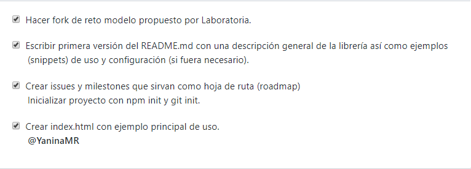
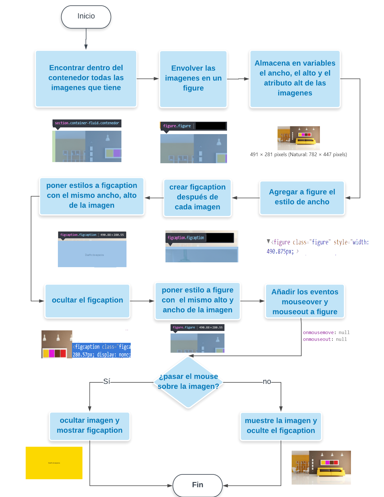

Cardify
=================

Es un plugin de jQuery que dado un contenedor busca las imagenes, envuelve en figure y agrega figcaption dentro de este el alt de la imagen al pasar el mouse muestra el figcaption con el alt centrado y oculta la imagen 

## Uso 

 realizar un llamado :
 ```js
jQuery(function ($) {
  return $('.contenedor').cardify({});
});
```
## Herramientas Tecnológicas
 * **[ECMA script 6](http://es6-features.org/)**
 * **[Bootstrap 3.3](http://getbootstrap.com/docs/3.3/)**   
 * **[Font Awesome](https://fontawesome.com/icons)**  
 * **[Firebase ](https://console.firebase.google.com/)**


## Planificación



## Flujo de Proceso para codificar



## Demo


